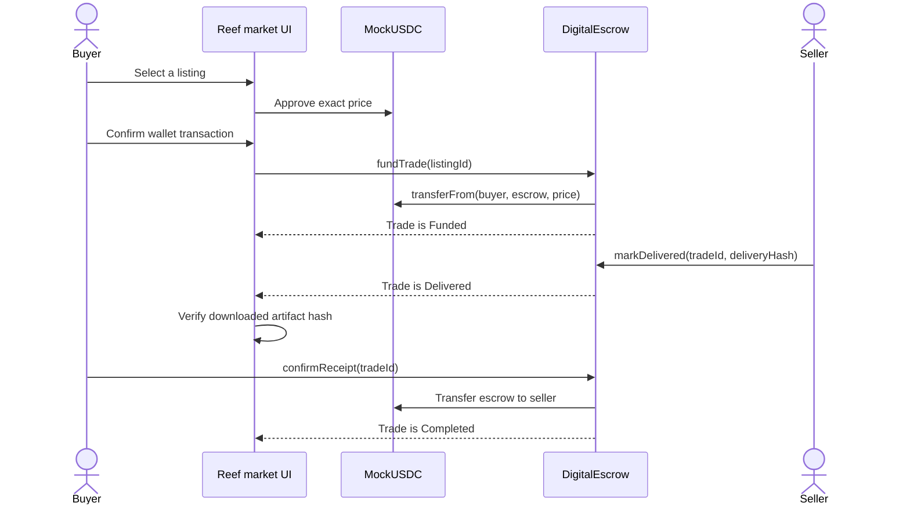
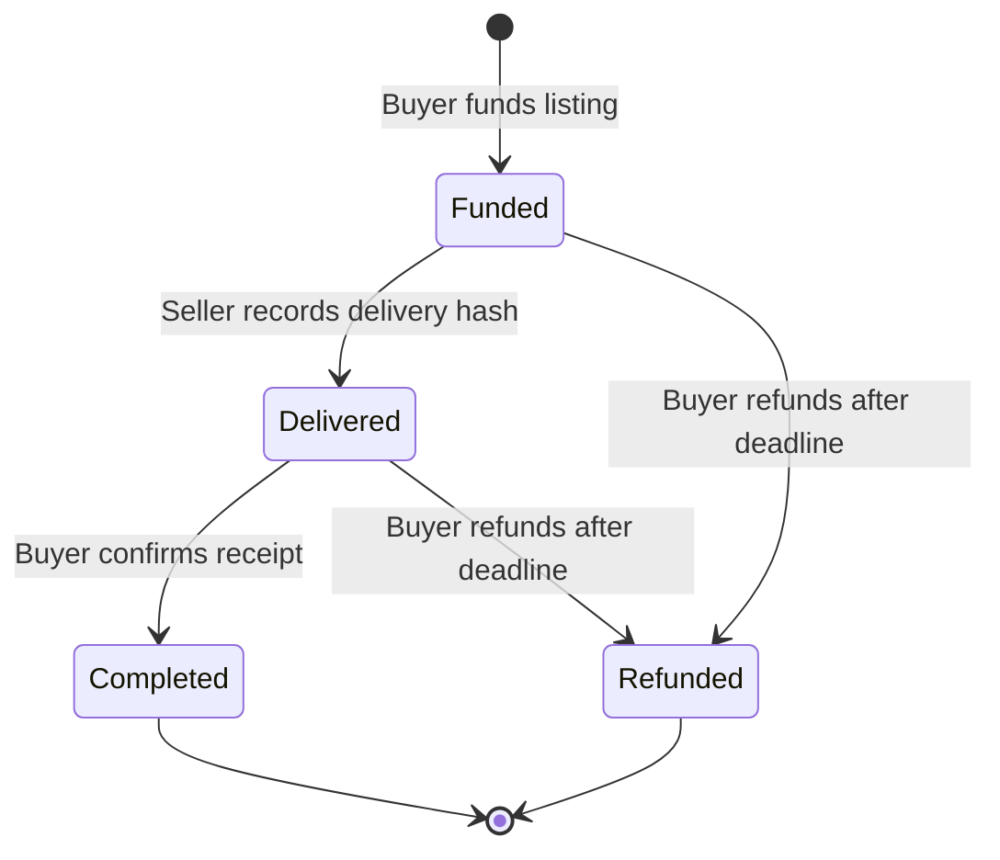
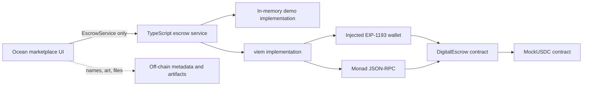

# MonFish Market

> **Swim the seven reefs. Trade through trust.**

MonFish Market is an ocean-themed marketplace concept for digital goods on
[Monad](https://www.monad.xyz/). Buyers explore reef markets as fish, discover
seller stalls, and pay with a six-decimal test token called **MockUSDC**. The
payment is held by a smart-contract escrow until the seller records delivery
and the buyer confirms receipt.

The project combines the familiar Indonesian **rekber** (shared-account escrow)
model with a small game-like marketplace. Blockchain is used only where it is
load-bearing: custody, state transitions, settlement, refunds, and an auditable
event trail. Swimming, artwork, listing descriptions, and digital-file delivery
remain off-chain.

## Repository status

This checkout contains several parts at different levels of completeness:

| Part | Status in this checkout |
| --- | --- |
| Escrow domain API | Tracked and type-checkable in `shared/escrow.ts` |
| Real Monad/viem integration | Tracked and type-checkable in `shared/escrow.real.ts` |
| Product and architecture documents | Tracked under `docs/` |
| Browser demo | A prebuilt, untracked static bundle is present in `dist/`; its React source and build scripts are not present |
| Solidity contracts | Untracked Foundry artifacts are present in `contracts/out/`, but Solidity source, tests, configuration, and scripts are not present in this checkout |
| Testnet deployment | No tracked deployment-address file is present |

As a result, the TypeScript boundary can be installed and checked from source,
and the current static demo can be previewed. The Solidity contracts and browser
application cannot currently be rebuilt from this checkout alone. Generated
folders such as `dist/`, `contracts/out/`, `.tools/`, and `node_modules/` should
not be treated as substitutes for their missing source or configuration.

## What the product does

The MVP has two explorable zones:

- **Coral Capital** (`zoneId: 0`) — a bright, shallow reef and creator hub.
- **Sardine Harbor** (`zoneId: 1`) — the main merchant port and demo market.

A seller creates a reusable **Listing** containing a seller address, zone,
product hash, MockUSDC price, and delivery-window duration. Human-readable
metadata—name, description, art, and stall position—lives off-chain and is keyed
by listing ID.

Every funded purchase creates a new **Trade**. A listing can therefore produce
many independent trades.



If the trade deadline passes before completion, the buyer can call
`refundExpired(tradeId)` from either `Funded` or `Delivered`. The escrow then
returns the tokens to the buyer and enters the terminal `Refunded` state.

## Escrow state machine



| State | Meaning | Allowed next action |
| --- | --- | --- |
| `Funded` (`0`) | MockUSDC is held by the escrow contract | Seller delivers, or buyer refunds after expiry |
| `Delivered` (`1`) | Seller has committed a delivery hash on-chain | Buyer confirms, or buyer refunds after expiry |
| `Completed` (`2`) | Buyer confirmed and funds were paid to the seller | None; terminal |
| `Refunded` (`3`) | Funds were returned to the buyer | None; terminal |

`Pending` and `Failed` are UI states for an in-flight or reverted transaction;
they are not contract states. There is intentionally no `Cancelled` state,
mutual cancellation, dispute process, platform fee, or seller co-signature in
the MVP.

The deadline is calculated when funding occurs:

```text
deadline = funding block timestamp + listing delivery window
```

This prevents a reusable listing from expiring before a buyer purchases it.

## Trust model

The contract can prove that tokens moved and that a seller committed a hash. It
cannot prove that an off-chain file was useful, complete, or acceptable.

The MVP therefore makes these guarantees and trade-offs explicit:

- The escrow contract, not the platform or seller, holds funded MockUSDC.
- Only the listing seller can mark a funded trade as delivered.
- Only the trade buyer can confirm receipt or request an expired refund.
- Seller payment happens only when the buyer confirms receipt.
- A delivery hash identifies what was delivered; it is not proof of quality.
- A buyer may receive a product and still refund after expiry by refusing to
  confirm. Reputation, encrypted delivery, and arbitration are future work.

This is buyer-favouring escrow for a hackathon MVP, not a production dispute
resolution system. Do not use it to custody assets of real value without a full
security review and a production-grade delivery model.

## Architecture



### Escrow Service boundary

`shared/escrow.ts` is the canonical contract between the frontend and chain
integration. It defines:

- `Listing`, `Trade`, `TradeStatus`, and transaction/event types.
- Read operations for balances, listings, and buyer trades.
- Write operations for approval, funding, delivery, confirmation, and refunds.
- `TxRef.wait()`, which lets the UI wait for finality before unlocking a
  download or announcing payment.
- `onTradeEvent()`, a live transition feed for marketplace notifications.
- Canonical zone names and six-decimal MockUSDC formatting.

The UI is designed against this interface, so a mock service can be swapped for
the real chain service without changing marketplace components.

### Real chain implementation

`shared/escrow.real.ts` implements the boundary with viem:

- An injected EIP-1193 provider supplies the buyer wallet.
- A public HTTP client reads finalized contract state.
- Writes are simulated before opening the wallet.
- Estimated gas receives a 10% buffer.
- `TxRef.wait()` waits for a receipt and then checks Monad's finalized block.
- Transaction logs are decoded to obtain newly created trade IDs.
- Contract events are watched and emitted to the UI only after finality.
- `getMyTrades()` currently scans all trade IDs and filters by buyer. This is
  acceptable for a tiny demo but should be replaced by indexed event queries or
  an indexer at marketplace scale.

The real implementation deliberately rejects `markDelivered()`: in the planned
demo the seller performs that action from a seller-owned script, while the
browser wallet represents the buyer.

### Smart contracts

The generated ABI shows two contracts:

- **`DigitalEscrow`** — creates listings, pulls approved MockUSDC into escrow,
  records delivery, pays sellers after confirmation, and refunds expired trades.
- **`MockUSDC`** — a six-decimal test ERC-20 used because the design does not
  assume an official testnet USDC. MON is used only for network gas.

The intended Solidity implementation uses OpenZeppelin `SafeERC20` and
`ReentrancyGuard`. IDs start at `1`; listings are reusable; self-purchases are
rejected; and completed/refunded trades are terminal. The generated test ABI
lists coverage for authorization, approval, reusable listings, deadline
calculation and overflow, happy-path settlement, refunds, terminal states, and
event emission. The corresponding `.sol` files are not available in this
checkout, so these tests cannot currently be rerun.

## Tech stack

| Layer | Technology | Purpose |
| --- | --- | --- |
| Network | Monad, EVM | Fast, low-cost escrow settlement |
| Contracts | Solidity + Foundry | Escrow/token implementation, tests, deployment scripts (artifacts only in this checkout) |
| Contract safety | OpenZeppelin Contracts | Safe ERC-20 transfers and reentrancy protection |
| Chain client | viem `2.55.10` | Wallet connection, reads, simulations, writes, receipts, events, and finality |
| Shared domain layer | TypeScript `5.9.2`, strict mode, ES2022 | Stable frontend/blockchain service boundary |
| Browser demo | React + Vite | Ocean marketplace experience (visible only as a prebuilt bundle here) |
| Payment asset | MockUSDC, 6 decimals | Predictable dollar-style demo pricing |
| Wallet transport | EIP-1193 | Browser-wallet interaction |
| Documentation | Markdown + Mermaid | Product, domain, architecture, and integration decisions |

The tracked root package intentionally has only `viem` as a runtime dependency
and TypeScript as a development dependency. React/Vite packages visible in a
local `node_modules/` directory are not declared by the tracked `package.json`
and cannot be relied upon for a clean installation.

## Project structure

```text
monfish-market/
├── shared/
│   ├── escrow.ts              # Canonical domain types and EscrowService API
│   └── escrow.real.ts         # Real viem + injected-wallet implementation
├── docs/
│   ├── monfish-prd.md         # Product vision, MVP, demo, risks, roadmap
│   ├── integration-memo.md    # Frontend/backend integration contract
│   ├── backend-plan.md        # Planned contract/deployment work
│   └── adr/
│       └── 0001-escrow-state-machine.md
├── contracts/
│   ├── out/                   # Untracked generated Foundry artifacts
│   └── cache/                 # Untracked generated Foundry cache
├── dist/                      # Untracked prebuilt browser demo and demo files
├── CONTEXT.md                 # Canonical project vocabulary
├── skills-lock.json           # Pinned agent-skill sources and hashes
├── package.json               # Type-check script and tracked dependencies
└── tsconfig.json              # Strict NodeNext TypeScript configuration
```

## Getting started

### Prerequisites

- Node.js 20 or newer (Node.js 22 is known to work in the current environment)
- npm
- Python 3 only if you want to serve the existing static demo
- A desktop viewport at least 1024 px wide for the current demo layout

### Install and validate the tracked source

```bash
npm ci
npm run typecheck
```

`npm run typecheck` executes `tsc --noEmit` over `shared/**/*.ts`. There is no
tracked frontend build, test, lint, or development-server script at present.

### Preview the existing static demo

If `dist/` exists in your checkout:

```bash
python -m http.server 4173 --directory dist
```

Then open <http://localhost:4173>. Use a web server rather than opening
`dist/index.html` directly because the demo fetches artifact ZIP files by URL.

The bundle runs in **Demo Mode** with an in-memory escrow service. It supports:

1. Connecting a fake demo wallet.
2. Moving with WASD/arrow keys or browsing stalls directly.
3. Approving MockUSDC and funding a trade as two distinct actions.
4. Marking a trade delivered, injecting a bad hash, expiring a trade, or
   simulating failed/delayed wallet actions through developer controls.
5. Hash-verifying an artifact before unlocking its download.
6. Confirming receipt or reclaiming funds after expiry.

The included ZIPs are tiny placeholders, not production digital products.

## Using the real Escrow Service

The frontend must supply the chain and deployment configuration plus an
injected wallet provider:

```ts
import { createRealEscrowService } from './shared/escrow.real.js';

const service = createRealEscrowService({
  chainId: 10143,
  rpcUrl: 'https://testnet-rpc.monad.xyz',
  escrowAddress: '0x...',
  usdcAddress: '0x...',
  walletProvider: window.ethereum,
  pollingIntervalMs: 1_000,
});

const buyer = await service.connectWallet();
const listings = await service.getListings();

const approval = await service.approveUsdc(listings[0].priceUsdc);
if ((await approval.wait()) !== 'success') throw new Error('Approval reverted');

const { tradeId, tx } = await service.fundTrade(listings[0].id);
if ((await tx.wait()) !== 'success') throw new Error('Funding reverted');
```

The chain ID above appears in the project plan, but this repository has no
tracked deployment file. Replace both addresses with values from a deployment
you control and verify the network configuration before submitting a wallet
transaction. Never commit private keys or seed phrases.

## Intended contract development workflow

Once the missing Foundry source tree is restored, the expected workflow is:

```bash
cd contracts
forge build
forge test -vvv
```

Deployment was designed around a `DeployAndSeed.s.sol` script that deploys
MockUSDC and `DigitalEscrow`, mints demo balances, and creates the seed listings.
Do not run a broadcast command until the script, `foundry.toml`, environment
variables, RPC URL, and target chain have all been restored and reviewed.

## Seed marketplace

The product documents and current demo use these canonical listings:

| ID | Zone | Listing | Price | Delivery window |
| ---: | --- | --- | ---: | ---: |
| 1 | Sardine Harbor | Pixel Reef Starter Pack | $5.00 MockUSDC | 24 hours |
| 2 | Sardine Harbor | Ghost Ship Map Pack | $3.00 MockUSDC | 60 seconds |
| 3 | Coral Capital | Captain's Hat Template | $2.00 MockUSDC | 24 hours |

The 60-second listing exists to demonstrate the expired-refund path. Monetary
values are stored in six-decimal base units, so `$5.00` is `5_000_000n`.

## MonSkills and agent skills

`skills-lock.json` records reproducible agent-development skills and their
content hashes. It is tooling metadata for contributors and coding agents; none
of these skills ship in, or execute as part of, the marketplace application.

The lockfile pins these skills from
[`therealharpaljadeja/monskills`](https://github.com/therealharpaljadeja/monskills):

| MonSkill | Intended contribution to this project |
| --- | --- |
| `monskill` | Entry point and routing for the Monad skill set |
| `why-monad` | Explains where Monad materially benefits the product |
| `concepts` | Monad/EVM concepts and network behavior |
| `addresses` | Network and contract-address handling |
| `gas` | Gas estimation and Monad-specific transaction guardrails |
| `wallet-integration` | Browser wallet connection and transaction UX |
| `scaffold` | Initial Monad project structure |
| `tooling-and-infra` | Foundry, RPC, deployment, and development tooling |
| `indexer` | Event/indexing guidance for scaling beyond full ID scans |

The same lockfile also pins general engineering skills from other repositories,
including domain modeling, architecture, TDD, diagnosis, review, research,
prototyping, implementation, handoff, and git guardrails. A lock entry proves
that a skill version was installed/pinned; it does **not** by itself prove which
skill was invoked for a particular commit. Git history and project documents do
not contain per-commit skill-usage provenance, so the table above describes the
skills' project roles rather than claiming an auditable invocation history.

## Design decisions and conventions

- Use **Listing**, **Trade**, **Zone**, and **Stall** as defined in `CONTEXT.md`.
- Call the test token **MockUSDC**, not unqualified USDC.
- A trade does not exist before funding; `Funded` is its initial state.
- The seller action is delivery, not agreement to release payment.
- Gate irreversible UI changes on `TxRef.wait()`, not transaction submission.
- Keep listing metadata off-chain and use the on-chain product hash as its
  integrity anchor.
- Use MON only for gas; product prices and escrow balances use MockUSDC.
- Do not present a delivery hash as automatic proof of quality or acceptance.

## Known limitations

- This checkout is missing contract and browser-app source files needed for
  clean rebuilds.
- There is no tracked deployment manifest or currently verifiable live address.
- The checked-in package exposes type checking only; it has no automated tests.
- `getListings()` and `getMyTrades()` perform linear scans of contract IDs.
- The demo uses an in-memory buyer flow and placeholder artifacts.
- Delivery is not encrypted or decentralized.
- There is no reputation, arbitration, dispute, fee, multi-token, or cancellation
  system.
- The current experience is desktop-only and not multiplayer.
- The contracts represented by local generated artifacts have not been audited.

## Roadmap

The planned next steps are to restore and track all source/build configuration,
publish verified deployment addresses, wire the UI to the real service, and add
CI for TypeScript and Foundry tests. Product-level follow-ups include encrypted
delivery, event indexing, seller/buyer reputation, dispute resolution,
additional reef zones, mobile support, and real-time social presence.

## Further reading

- [`CONTEXT.md`](./CONTEXT.md) — canonical language and domain definitions
- [`docs/monfish-prd.md`](./docs/monfish-prd.md) — complete product requirements
- [`docs/integration-memo.md`](./docs/integration-memo.md) — frontend handoff
- [`docs/backend-plan.md`](./docs/backend-plan.md) — backend implementation plan
- [`docs/adr/0001-escrow-state-machine.md`](./docs/adr/0001-escrow-state-machine.md) — lifecycle decision and trade-offs

## License

No license file is currently included. Unless a license is added, normal
copyright restrictions apply; do not assume the repository is open source.
